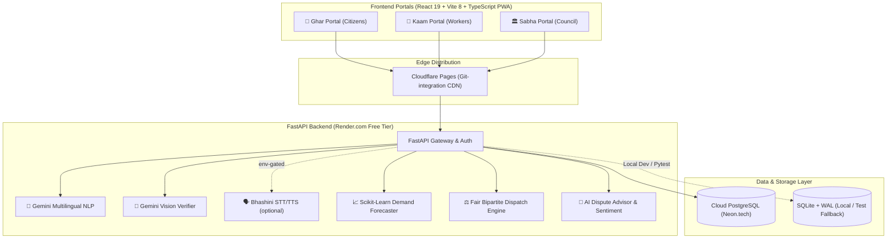

# 🏛️ SahakarSetu (सहकारसेतु)
### *AI-Powered Civic Cooperative Platform for Fair Work Allocation & Community Governance*
**Smart India Hackathon (SIH 2026)**

[](tests/)
[](https://fastapi.tiangolo.com)
[](app/services/)
[](schema.sql)
[](frontend/)
[-purple.svg?style=flat-square)](docs/EXPLANATION_GUIDE.md)
[-green.svg?style=flat-square)](docs/DEPLOY.md)
[](LICENSE)

---

## 📌 Problem & Vision
Urban household service aggregators (commercial gig apps) exploit informal artisans through 20-30% commissions, arbitrary algorithm penalties, and opaque ratings that monopolize work among top earners.

**SahakarSetu** decentralizes municipal household services by empowering local artisan cooperatives:
* ⚖️ **Fair Work Distribution:** Bipartite matching algorithm ensures idle artisans get equitable opportunities rather than work being monopolized by a few.
* 🎙️ **Multilingual Voice AI:** Offline-first voice parsing (Hindi, Hinglish, English) with an optional Bhashini (IndiaAI) cloud fallback.
* 📈 **Machine Learning Demand Forecasting:** `scikit-learn` Ridge regression predicts weekly ward demand and guarantees minimum wage floors without predatory surge pricing.
* 📸 **Vision Proof-of-Work Verification:** Gemini Vision verifies artisan start/end photos, with a robust offline heuristic fallback.
* 🤝 **AI Dispute Mediation:** Transparent midpoint settlement calculator & diplomatic bilingual council mediation notes.
* 💰 **Zero Platform Fees:** 100% direct customer-to-worker payment; transparent community fund ledger allocation (85% artisan · 10% welfare · 5% ops).

---

## 🏛️ The Three Portals

| Portal | Audience | Core Capabilities |
|---|---|---|
| **🏡 Ghar** | Households & Citizens | Voice & text booking, live job tracking (SSE), transparent standard rate quotes, fair price agreement, UPI QR payment, review rating, and feedback. |
| **🔧 Kaam** | Skilled Artisans & Workers | Voice availability declaration, job accept/decline, bill proposal against rate card, Aadhaar KYC document upload, direct cash/UPI receipt. |
| **🏛️ Sabha** | Cooperative Council & Ward Leaders | Global batch dispatch, ML demand heatmaps, staffing shortage forecasts, dispute resolution centre, cooperative welfare fund ledger, invoicing, worker document verification. |

---

## 🏗️ System Architecture



---

## 🤖 AI / ML Architecture Breakdown

### 1. Multilingual Voice NLP Engine (`app/services/gemini_nlp.py`)
* Processes conversational voice queries in **Hindi (Devanagari)**, **Hinglish**, and **English**.
* Enforces strict JSON extraction: `{ trade, urgency, preferred_time, notes }`.
* **Model fallback chain:** `gemini-flash-lite-latest` → `gemini-flash-latest` → offline regex parser.
* **Offline Resilience:** Embedded keyword and regex heuristic fallback guarantees 100% uptime even if Gemini API quota is exhausted during demonstrations.

### 2. Offline-First Voice & Bhashini Speech Interfaces (`app/services/voice.py` + `bhashini_client.py`)
* Rule-based bilingual (Hinglish/Hindi/English) speech-to-intent parsing works **fully offline** with confidence gating and confirmation prompts.
* Optional, env-gated **Bhashini (IndiaAI)** STT/TTS fallback when the offline parser is not confident — no network calls unless endpoints and keys are configured.

### 3. Tabular Demand and Fair-Wage Forecaster (`app/services/demand_forecast.py`)
* Regularized `Ridge` regression trained on day-of-week, weekend, seasonal and lag patterns (pure-Python kernel fallback when scikit-learn is absent).
* Calculates a guaranteed **Wage Floor Band** (90% of baseline) and a **Fair Recommended Rate** (baseline + capped weekend surge) to prevent price gouging — exposed via `/forecast/ml` and `/forecast/dynamic-pricing`.

### 4. Fair Batch Worker Dispatch Engine (`app/services/worker_allocation.py`)
* Computes normalized multi-objective utility scores per booking–worker pair:
  ```
  Utility = 0.35 × Proximity + 0.35 × Fairness (Idle Rotation) + 0.20 × Rating + 0.10 × Status
  ```
  *(urgent jobs shift to 0.70 × Proximity + 0.20 × Rating + 0.10 × Fairness)*
* Solves global maximum-weight bipartite matching (`networkx`) across all pending bookings in one pass — and new bookings are **auto-assigned** the moment they are placed.

### 5. AI Dispute Resolution Advisor (`app/services/dispute_advisor.py`)
* Computes mathematical material-cost-safe midpoint settlements.
* Generates diplomatic bilingual (Hindi/English) mediation notes for cooperative council sign-off.
* Analyzes review sentiment (`TextBlob` + lexicon fallback) to proactively flag toxic grievances.

### 6. Multi-Modal Vision Proof-of-Work Verifier (`app/services/vision_verifier.py`)
* Analyzes artisan start (damage/context) and end (completed repair) photos with **Gemini Flash Vision**.
* Checks trade consistency, visual resolution of the problem, and plausibility scoring (0.00–1.00) to flag suspicious, black, or blank photos.
* Deterministic offline heuristic fallback keeps verification functional without an API key.

---

## ⚡ Quick Start (Local Setup)

### 1. Backend Setup
```bash
# Clone repository
git clone https://github.com/Aadi-j08/SIH-2026.git
cd SIH-2026

# Virtual environment
python3 -m venv .venv
source .venv/bin/activate  # On Windows: .venv\Scripts\activate

# Install dependencies
pip install -r requirements.txt

# Seed realistic demo data
python3 scripts/seed_demo_data.py

# Start FastAPI server
uvicorn app.main:app --reload --port 8000
```

### 2. Frontend Setup (In a separate terminal)
```bash
cd frontend
npm install
npm run dev
```

### 3. All-in-one (Docker, optional)
```bash
docker compose up --build
# API on http://127.0.0.1:8000, web app served at http://127.0.0.1:8000/app/
```

| Interface | Local URL | Description |
|---|---|---|
| **Web Application** | `http://localhost:5173/` | React PWA (Landing + Portals) |
| **Web App (API host)** | `http://localhost:8000/app/` | Built SPA served by FastAPI |
| **Interactive API Docs** | `http://localhost:8000/docs` | Swagger / OpenAPI UI |
| **API Health Check** | `http://localhost:8000/` | Backend status & engine metadata |

> Copy `.env.example` to `.env` and set `GEMINI_API_KEY` (free from [Google AI Studio](https://aistudio.google.com)). Everything else works offline out of the box.

---

## 🔑 Demo User Accounts (Pre-Seeded)

All demo accounts share the password: **`demo1234`** (local development only — hosted demos must set `SAHAKARSETU_DEMO_PASSWORD`, min. 12 characters)

| Portal | Role | Phone Number | Identity / Locality |
|---|---|---|---|
| **🏡 Ghar** | Customer | `9876543210` | Aarav Sharma (Resident, Arera Colony) |
| **🔧 Kaam** | Artisan / Worker | `9876543211` | Rameshwar Prasad (Verified Plumber, 4.8★) |
| **🏛️ Sabha** | Council Secretary | `9876543212` | Sunita Verma (Cooperative Secretary) |

*Council sign-up code for new registrations:* `SABHA-2026` (rotate it with `secrets.token_urlsafe(24)` before any real deployment)

---

## 🧪 Test Suite & Quality Assurance

The codebase ships 391 automated tests across authentication, authorization, AI services, pricing formulas, booking flows, Postgres integration, and database integrity:

```bash
# Run the full suite
pytest -q

# Frontend typecheck & build
cd frontend && npm run typecheck && npm run build
```

```
=========================== 360 passed, 31 skipped, 5 warnings in 39.42s ============================
```

CI (GitHub Actions) runs the suite on every push: [`.github/workflows/ci.yml`](.github/workflows/ci.yml), plus Neon Postgres verification workflows.

---

## ☁️ 100% Free Production Deployment

| Component | Platform | Configuration | Cost |
|---|---|---|---|
| **Frontend** | **Cloudflare Pages** | Git integration builds `frontend/` (React PWA) on every push | **₹0** |
| **Backend** | **Render.com** | Python web service via [`render.yaml`](render.yaml) | **₹0** |
| **Database** | **Neon.tech / Supabase** | Serverless PostgreSQL via [`schema.sql`](schema.sql); SQLite fallback | **₹0** |
| **AI / NLP** | **Google AI Studio** | Gemini Flash free-tier API (offline fallbacks built in) | **₹0** |

Full step-by-step guide: [`docs/DEPLOY.md`](docs/DEPLOY.md). Docker (`Dockerfile` + `docker-compose.yml`) and Fly.io (`fly.toml`) are supported alternatives.

---

## 📂 Project Structure

```
SIH-2026/
├── app/                    # FastAPI backend
│   ├── routers/            # auth, assistant, booking_flow, feedback, invoicing, kaam, pricing, sabha, welfare, workers
│   ├── services/           # gemini_nlp, voice, bhashini_client, vision_verifier, demand_forecast,
│   │                       # worker_allocation, allocation, dispute_advisor, forecast, staffing, ledger, ...
│   ├── main.py             # API gateway, tenant middleware, auto-assign
│   ├── tenancy.py          # Multi-cooperative isolation (federation-ready)
│   └── pg.py               # Postgres engine with SQLite fallback
├── frontend/               # React 19 + Vite 8 + TypeScript PWA (Leaflet maps)
├── scripts/                # seed_demo_data.py, run_server.py
├── tests/                  # 30 test modules (391 tests)
├── docs/                   # ARCHITECTURE, DEVELOPMENT, DEPLOY, INTEGRATION, IMPLEMENTATION, EXPLANATION_GUIDE
├── schema.sql              # Cloud PostgreSQL schema
├── render.yaml / Dockerfile / docker-compose.yml / fly.toml
└── requirements.txt
```

---

## 👥 Team
* **AI/ML & Backend:** Aman Yadav, Aadi Jain, Abhishek Meena
* **Project Repository:** [SIH-2026](https://github.com/Aadi-j08/SIH-2026)
* **Submission Event:** Smart India Hackathon 2026
