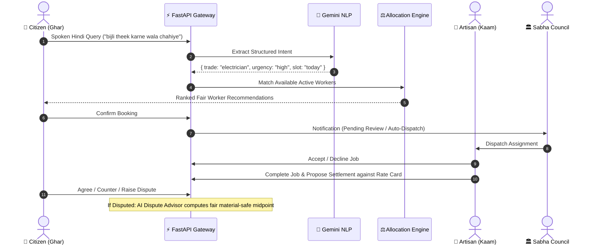

# 🏛️ SahakarSetu — Technical Architecture Document

## 1. System Overview
**SahakarSetu** is a decentralized, three-portal civic cooperative platform for municipal artisans and households.
The platform is designed around zero-commission cooperative principles:
- **Decoupled Architecture:** React 18 PWA frontend communicating with a high-performance FastAPI backend over REST & SSE.
- **Dual-Database Layer:** Serverless Cloud PostgreSQL (Neon/Supabase) in production with an SQLite WAL fallback for local development.
- **AI/ML Layer:** Google Gemini 1.5 Flash for conversational Indian multilingual NLP alongside regularized `scikit-learn` Ridge regression for local demand forecasting and bipartite graph matching for fair dispatch.

---

## 2. Request & Allocation Lifecycle

---

## 3. Backend Module Map

| Layer / Directory | Primary Modules | Description |
|---|---|---|
| **API Entry** | `app/main.py` | FastAPI application, middleware (CORS, trusted host), static assets, lifecycle handlers. |
| **Auth & Security** | `app/auth.py`, `app/routers/auth.py` | PBKDF2 with SHA-256 (200k iterations), session cookies, portal role isolation (Ghar/Kaam/Sabha). |
| **Database & Schema** | `app/database.py`, `schema.sql` | Auto-detecting PostgreSQL & SQLite connection manager with WAL mode and migration runner. |
| **Multilingual NLP** | `app/services/gemini_nlp.py` | Gemini 1.5 Flash structured parser with offline regex & keyword heuristic fallback. |
| **ML Demand Forecasting** | `app/services/demand_forecast.py` | `scikit-learn` Ridge regression time-series forecaster with fair wage floor calculation. |
| **Fair Allocation** | `app/services/worker_allocation.py`, `allocation.py` | Multi-objective scoring (Proximity, Idle rotation, Ratings) + Bipartite matching solver. |
| **Disputes & Mediation** | `app/services/dispute_advisor.py`, `disputes.py` | Mathematical compromise midpoint calculator + Gemini diplomatic mediation note generator. |
| **Pricing & Rate Cards** | `app/rates.py`, `settlements.py` | Standard community hourly rate cards and rate-band validation. |
| **Live Events** | `app/events.py` | Server-Sent Events (SSE) event bus for live job status updates. |

---

## 4. Frontend Architecture

| Component Group | Directory / Files | Purpose |
|---|---|---|
| **API Client** | `frontend/src/api.ts` | Fully typed TypeScript client with auto-complete for all AI, booking, and auth routes. |
| **Routing & Shell** | `frontend/src/App.tsx`, `components/` | Portal-specific shells (`GharShell`, `KaamShell`, `SabhaShell`) with role-based routing. |
| **Design System** | `frontend/src/styles.css` | Warm civic palette tokens: Paper `#FCFAF6`, Terracotta `#C65D26` (Ghar), Green `#25984D` (Kaam), Indigo `#5E78D9` (Sabha). |
| **PWA & Offline** | `frontend/vite.config.ts`, `dist/sw.js` | Progressive Web App manifest and service worker caching for reliable low-bandwidth usage. |

---

## 5. Security & Data Isolation
1. **Portal Partitioning:** An account on `ghar` cannot access `kaam` worker APIs or `sabha` administrative dashboards.
2. **Parameterized SQL:** All database queries utilize parameterized placeholders (`?` or `%s`) to eliminate SQL injection vectors.
3. **No Third-Party Token Leakage:** Authentication tokens are stored in `HttpOnly` `SameSite=None` secure session cookies and checked server-side on every request.
